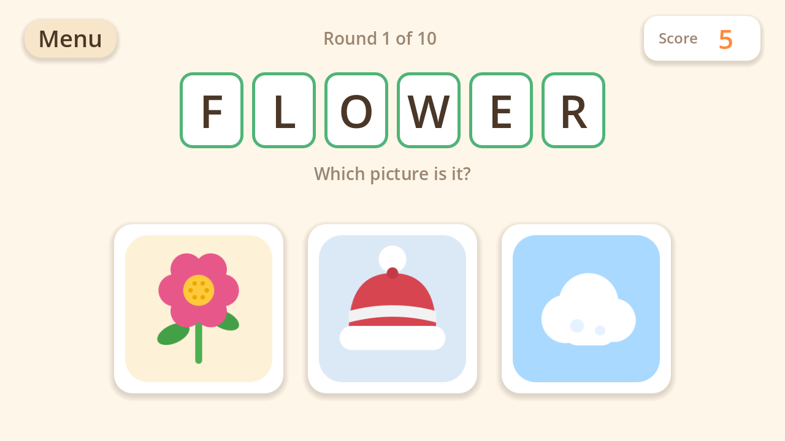
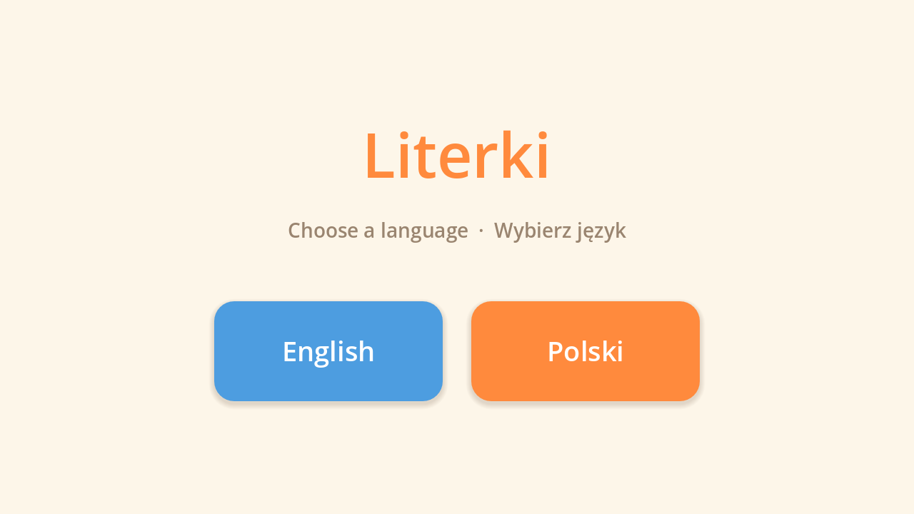
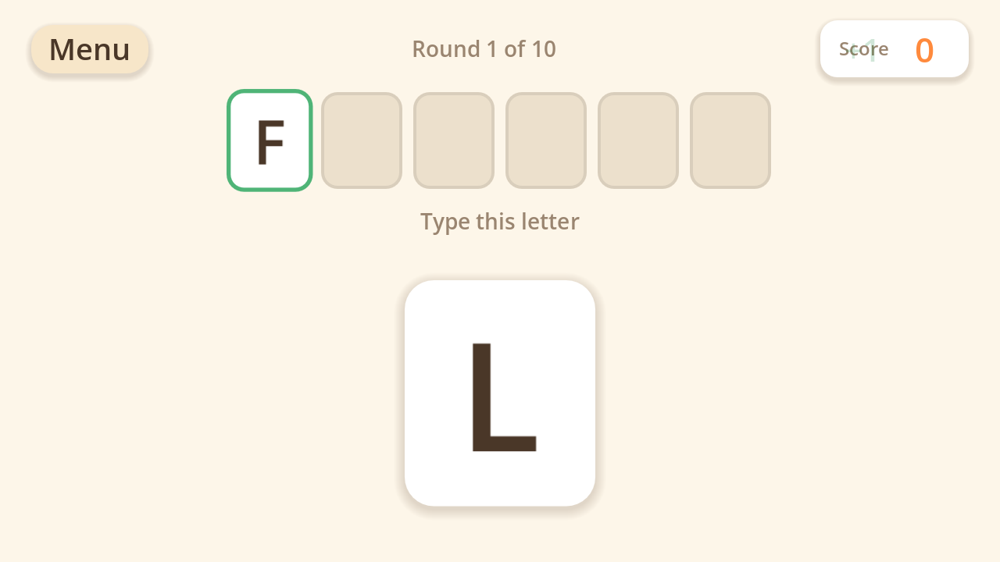

# Literki

A typing and reading game for young children, in **English** and **Polish**.



Each round shows one big letter at a time. The child types it, hears it spoken
aloud, and watches it fly up to join the word forming along the top of the
screen. When the word is finished the game spells it back, letter by letter —
but withholds the word itself. Then three pictures appear, and the child picks
the one the word describes; only once they have does the game finally say the
word. Working it out has to come from reading it, so hearing it is the reward
rather than the hint.

Ten rounds make a game, and the score goes on the board at the end.

| | |
|---|---|
|  |  |
| Pick a language to start | Letters fly up as they are typed |

## Scoring

| | |
|---|---|
| Correct letter | **+1** |
| Wrong letter | **−1** |
| Right picture, first try | **+3** |
| Right picture, second try | **+2** |
| Right picture, third try | **+1** |

A wrong picture is greyed out and the child keeps choosing, so a round always
ends by getting it right. The running total sits in the top corner throughout.

## Requirements

- [Godot 4.6](https://godotengine.org/) or newer

Speech uses whatever synthesiser the operating system already provides —
macOS Speech, Windows SAPI, or `speech-dispatcher` on Linux — so there is no
audio to download and nothing to configure. On a machine with no speech
support the game still plays, just silently.

## Running

```bash
godot --path .
```

The macOS build ships as an app bundle with nothing on `PATH`, so `godot` is
not a command until you make it one:

```bash
ln -sf /Applications/Godot.app/Contents/MacOS/Godot ~/.local/bin/godot
```

Or call the binary inside the bundle directly:

```bash
/Applications/Godot.app/Contents/MacOS/Godot --path .
```

## Tests

Game rules live in plain classes with no nodes in them, so a whole ten-round
game can be played out without a window:

```bash
godot --headless --script tests/run_tests.gd --quit
```

There is also a tour that drives the real screens with real key presses and
saves a screenshot at each step — useful for seeing a change rather than
reasoning about it:

```bash
godot --path . tools/tour.tscn -- /tmp/shots
```

Add `play` to play all ten rounds through the interface and check the score,
the round counter and the saved highscore:

```bash
godot --path . tools/tour.tscn -- /tmp/shots play
```

## Pictures

The thirty pictures are generated rather than hand-drawn, which is what keeps
them looking like one set:

```bash
python3 tools/generate_images.py
```

To look at them all at once:

```bash
godot --headless --script tools/preview_images.gd --quit -- /tmp/sheet.png
```

## Adding a language

Every picture is shared across languages, so a new language is a column of
words rather than a new set of drawings:

1. Add the two-letter code to `WordBank.LANGUAGES` and a name to
   `WordBank.LANGUAGE_NAMES`.
2. Add a word for each concept in `WordBank.CONCEPTS`.
3. Add the interface strings to `Texts.STRINGS`.

The tests will tell you if you missed one.

## Notes

- Speech needs a display server. `--headless` reports zero voices, so
  `tools/preview_images.gd` and the unit tests run headless, but anything that
  checks speech has to run windowed (which is what `tools/tour.tscn` does).
- Which voice each language uses is decided in `Speech.PREFERRED_VOICES`, by
  display name, falling back to whatever the system lists first.
- A few letters are played from a small recording instead of being synthesised,
  because the voice reads them badly and will not be talked out of it. Polish Y
  is the one: Zosia says its name, "igrek", which does not contain the sound the
  letter makes, and every dodge fails because she spells out any isolated letter
  string — "yy" comes out as "igrek igrek", byte for byte. So the vowel is cut
  out of her saying "ty", which keeps the voice identical to every other letter.
  `tools/make_letter_sounds.py` regenerates these; adding one is a line in
  `SOURCES`. Anything with a clip in `assets/speech/<language>/` wins over the
  synthesiser.
- The system voices already read Polish diacritics by their proper names — Zosia
  says "eł" for Ł and "cie" for Ć, not "el" and "ce". There is nothing to fix
  here, and `tools/check_voices.sh` proves it without anyone having to listen:
  it synthesises each letter beside the name it should be read as and compares
  the audio. Do not use duration for this — "el" and "eł" take exactly the same
  time to say, which makes it look like the voice ignores the diacritic.
- Polish words are shown and spoken with their proper spelling, but the plain
  ASCII letter is accepted too — a child on a US keyboard can type `slonce` for
  `SŁOŃCE` and still see and hear it spelled correctly.
- Digits, punctuation and the space bar are ignored rather than penalised. Only
  letter keys can cost a point.
- Scores can go negative, as specified. `Scoring.ALLOW_NEGATIVE_TOTAL` makes the
  game stop at zero instead.
